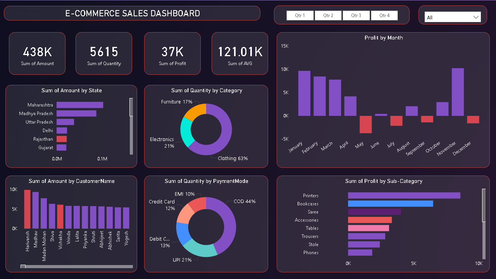

# 🛒 E-Commerce Sales Analytics Dashboard (Power BI)

This project showcases a professional and interactive Power BI dashboard that visualizes key sales insights from an e-commerce dataset.  
The dashboard is designed to help stakeholders understand performance across products, customers, regions, and time.

---

## 📌 Project Overview

- Built using **Power BI Desktop**
- Sales data sourced from an Excel dataset
- Interactive visuals, KPIs, and slicers
- Fully dynamic and filterable dashboard

---

## 🧠 Key Insights from the Dashboard

Here are some real insights extracted from the dashboard:

1. **💸 Top States by Sales**
   - **Maharashtra** and **Madhya Pradesh** are the top performers.
   - High contribution suggests targeting these states for upselling campaigns.

2. **📉 Unstable Monthly Profits**
   - Months like **May**, **June**, and **December** show **low or negative profits**.
   - Indicates seasonal dips, discounting issues, or inventory mismanagement.

3. **🛍️ Most Sold Category**
   - **Clothing** dominates with 63% of all items sold.
   - High demand suggests potential for deeper catalog expansion or marketing focus.

4. **🏆 Most Profitable Sub-Categories**
   - **Printers** and **Bookcases** top the chart in profitability.
   - Indicates margin-rich areas — ideal for bundling or promotions.

5. **📦 Low Performing Products**
   - Sub-categories like **Phones**, **Trousers**, and **Stoles** underperform in profit.
   - Worth reviewing pricing strategy or customer preference in these items.

6. **💳 Preferred Payment Methods**
   - **Cash on Delivery (COD)** leads at 44%, followed by **UPI** (21%) and **Debit Card** (13%).
   - High COD dependency may increase return or delivery failure risk — consider prepaid offers.

7. **👥 Key Customers**
   - Repeat high-volume customers include **Maharana**, **Madan Mohan**, and **Mishra**.
   - Opportunities exist for loyalty rewards or targeted retargeting.

8. **🌍 Regional Expansion Potential**
   - States like **Delhi**, **Gujarat**, and **Rajasthan** have lower sales.
   - Untapped growth potential — could benefit from local campaigns or delivery improvements.

---

## 📊 Dashboard Features

- 💰 Total Sales, Profit, Quantity, Discount KPIs
- 📆 Time-based analysis (Monthly & Yearly trends)
- 🛍️ Category & Sub-Category breakdown
- 🌍 Regional & segment-wise performance
- 🔍 Top & bottom performing products
- 🎯 Conditional formatting for low-profit segments

---

## ⚙️ Tools & Technologies

- **Power BI Desktop**
- **Power Query** – for data cleaning & transformation
- **DAX** – for calculated columns, KPIs, and measures
- **Excel** – as the raw dataset source

---

## 🖼️ Dashboard Preview



---

## 📂 Project Structure
```
Ecommerce-sales-dashboard/
│
├── E-COMMERCE SALE DASHBOARD(1).pbix     
├── README.md                                                   
├── Datasets/
│   └── E-Commerce_Sales.xlsx            
├── Images/
│   └── dashboard.png             
```

---

## 📊 Dataset Overview

- **File:** `E-Commerce_Sales.xlsx`
- **Contains Columns:**
  - Order ID, Customer Name, State, City, Product Category, Sub-Category
  - Sales, Profit, Quantity, Payment Mode, Order Date, Amount
- Cleaned and modeled in Power BI
- KPIs like Total Profit, Average Sales, Category-wise breakdown created using DAX

---

## 👩‍💼 About Me

**Aishwarya SR**  
🎓 Data Analyst skilled in SQL, Python, Power BI, and Excel  
📧 aishwaryasr097@gmail.com  
🔗 [LinkedIn](https://www.linkedin.com/in/aishwarya-sr/)  
💻 [GitHub](https://github.com/Aiishwarya01)

